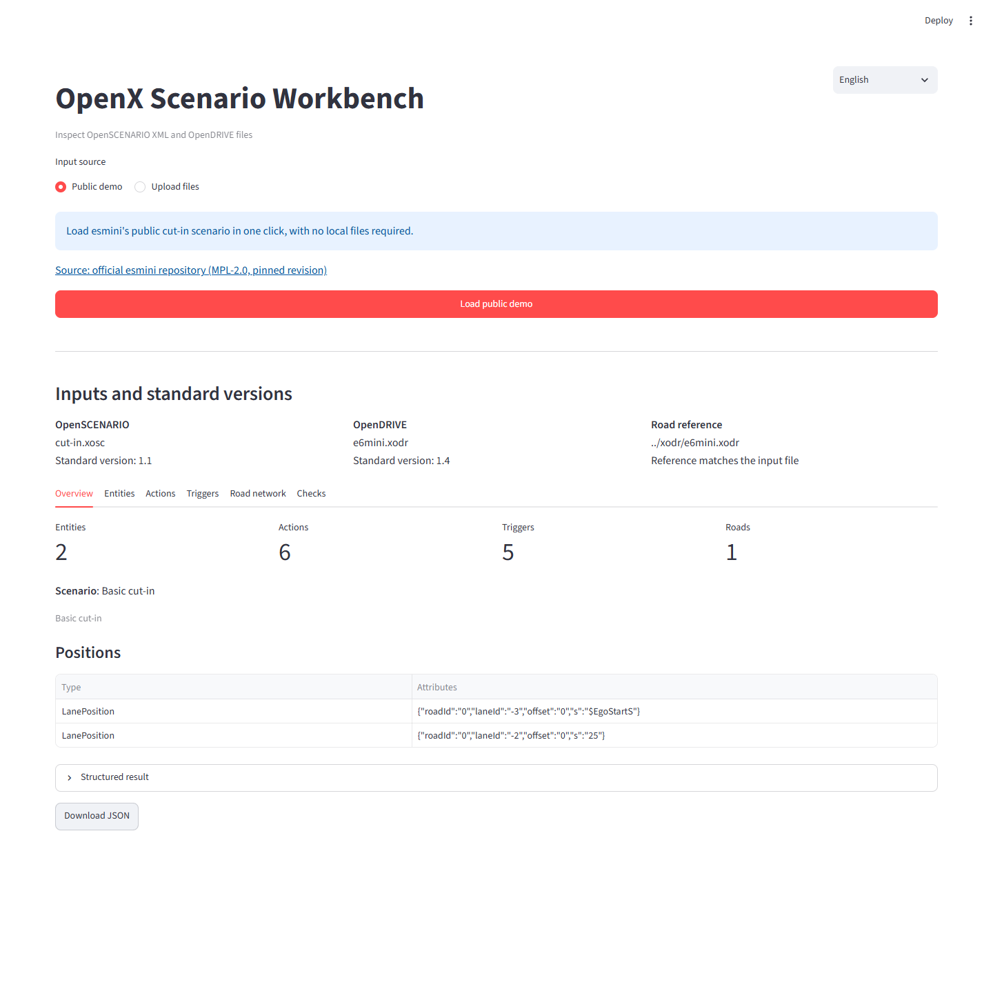
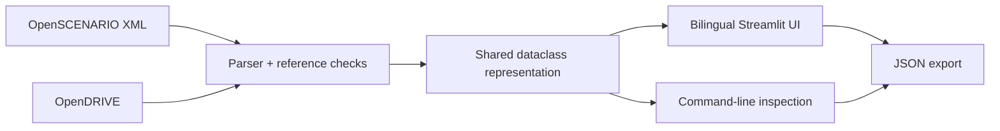

# OpenX Scenario Workbench

[](https://github.com/FFangx/openx-scenario-workbench/actions/workflows/ci.yml)
[](LICENSE)

English | [中文](README.zh-CN.md)

Inspect a traffic scenario before handing it to a simulator. OpenX Scenario Workbench reads **OpenSCENARIO XML (`.xosc`) and OpenDRIVE (`.xodr`)**, extracts a shared structured representation, and shows actors, actions, triggers, positions, and road metadata in a bilingual web UI or CLI.

**Try it:** start the app, choose **English** in the top-right corner, and click **Load public demo**. The pinned esmini cut-in example needs no API key, model download, or local input files.



## What it does

- Extracts scenario entities, selected action types, actor assignments, trigger types, and raw position attributes.
- Summarizes road IDs and counts of lane elements, junctions, signals, and static objects.
- Checks road-filename references, missing scenario entities, and missing road elements.
- Shows the result in six views: Overview, Entities, Actions, Triggers, Road network, and Checks.
- Exports the same structured JSON through the web UI and CLI.
- Loads a fixed revision of an upstream esmini example for a repeatable demo.

This v0.1 focuses on inspecting scenario structure. It does not run a simulation or perform full ASAM schema/conformance validation. Parameter expressions and external catalogs are not resolved; trigger thresholds and event hierarchy are not yet preserved. See [architecture and current limits](docs/ARCHITECTURE.md).

## Quick start

Requires **Python 3.10 or newer**. Commands below are run from the repository root.

```bash
git clone https://github.com/FFangx/openx-scenario-workbench.git
cd openx-scenario-workbench
python -m venv .venv
```

Activate the environment:

```powershell
# Windows PowerShell
.\.venv\Scripts\Activate.ps1
```

```bash
# macOS / Linux
source .venv/bin/activate
```

Install and start:

```bash
python -m pip install ".[dev]"
python -m streamlit run src/openx_workbench/app.py
```

Open the local URL printed by Streamlit. **Public demo** downloads two files from GitHub; **Upload files** works with your own local pair.

### CLI and offline sample

The small fixtures are authored for parser tests, not for simulator execution. They also provide an offline inspection example:

```bash
openx-inspect tests/fixtures/minimal.xosc tests/fixtures/minimal.xodr
```

The output has three top-level keys:

```json
{
  "scenario": {
    "name": "Minimal cut-in",
    "road_file": "minimal.xodr",
    "entities": [
      {"name": "Ego", "kind": "vehicle", "category": "car"},
      {"name": "Target", "kind": "vehicle", "category": "car"}
    ]
  },
  "road": {"road_ids": ["1"], "lane_count": 3},
  "warnings": []
}
```

This excerpt omits other parsed fields. Standard output contains JSON only; human-readable warnings go to standard error. A valid inspection exits with 0, including inspections with warnings. Invalid input exits with 2.

### Download the real public example

```bash
python scripts/fetch_esmini_demo.py
openx-inspect examples/esmini/cut-in.xosc examples/esmini/e6mini.xodr
```

The pinned example currently yields **2 entities, 6 actions, 5 trigger conditions, and 1 road**. These are extraction counts, not simulated behavior measurements. Downloads are stored under ignored `examples/esmini/`, alongside the upstream license.

## Design



The parser and representation are independent of Streamlit. The UI and CLI share input validation and the same inspection workflow, so future retrieval or comparison tools can consume the structured output directly.

[Architecture](docs/ARCHITECTURE.md) · [Roadmap](DEVELOPMENT_PLAN.md) · [Third-party notices](THIRD_PARTY_NOTICES.md)

## Development

After changing Python source files, reinstall with `python -m pip install ".[dev]"`. An editable install (`-e`) is also available, but normal installation avoids editable-path encoding issues on Windows installations with non-ASCII checkout paths.

```bash
python -m pytest -q
```

CI tests on Windows and Linux with Python 3.10 and 3.12 and builds the distribution. Automated tests use local fixtures and mocked downloads; the live public demo is checked separately.

## License and examples

Code and authored test fixtures are licensed under [MIT](LICENSE). The optional esmini example is fetched from a pinned upstream revision and is not committed to this repository. The screenshot above shows an inspection of that example. See [third-party notices](THIRD_PARTY_NOTICES.md) for its source and license.
