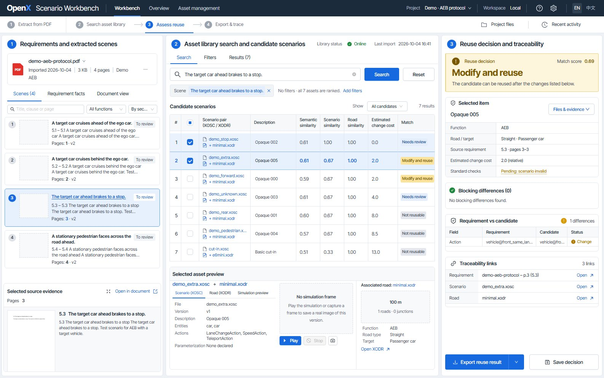
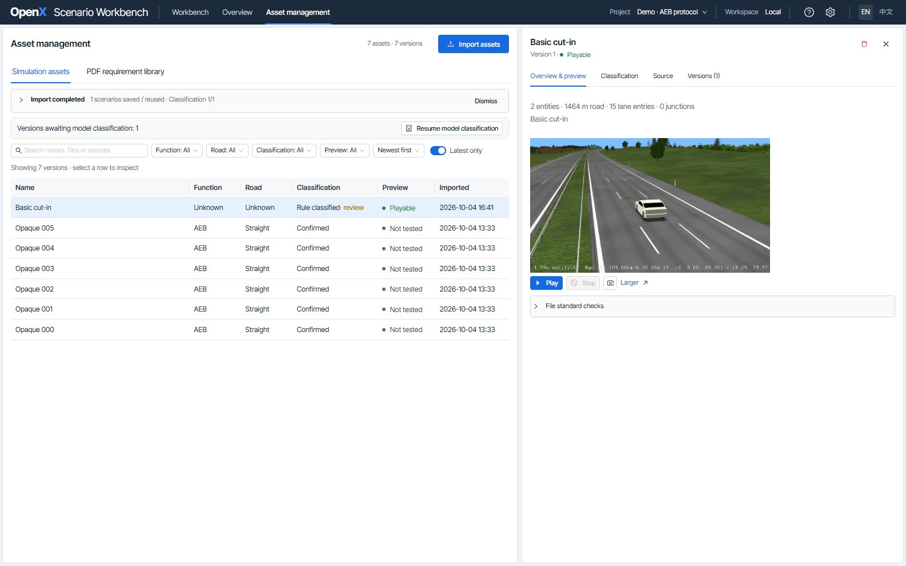
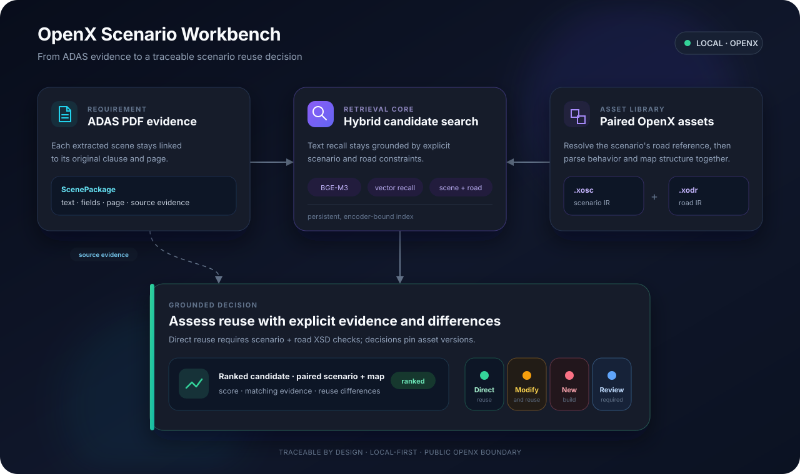
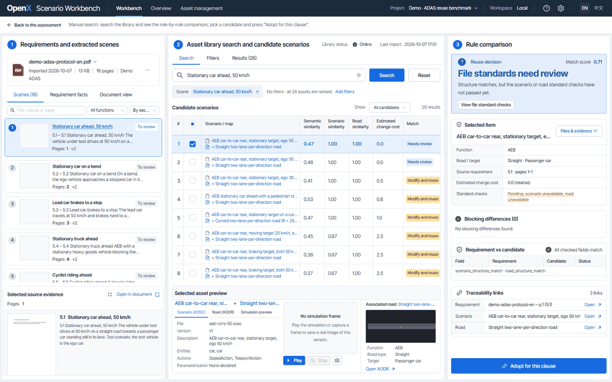

# OpenX Scenario Workbench

[](https://github.com/FFangx/openx-scenario-workbench/actions/workflows/ci.yml)
[](LICENSE)

English | [中文](README.zh-CN.md)

Turn an ADAS requirement into a traceable OpenX reuse decision. OpenX Scenario Workbench extracts numbered scene sections from **PDF**, builds paired **OpenSCENARIO (`.xosc`) + OpenDRIVE (`.xodr`)** assets from files or ScenarioManager-compatible `.sim` archives, and ranks candidates using text, scenario structure, and road fit. For every clause of a protocol PDF, a configured language model recommends the library asset to reuse — direct reuse, modify and reuse, not applicable or undetermined — and a person confirms the conclusion.

**Try it:** start the workbench (see [Quick start](#quick-start)), switch to English with the language button in the top-right corner, then open **Asset management → Import assets → Public esmini example**. Importing and inspecting the pinned esmini cut-in example needs no API key, model download, or local input files. For a complete walkthrough without your own files, run `openx-demo` after installing: it opens the workbench on an authored library of 26 assets and 38 reviewed requirements ([demo workspace](#demo-workspace)). Semantic search and simulation have separate dependencies below.



*The clause reuse assessment in `openx-demo`: one row per clause with the asset the model prefers and whether its three assessments agree, the first three confirmed by a person (green check); on the right the selected clause's source evidence, an esmini frame and top-down road of the preferred asset, and each candidate's verdict and reason. The demo's suggestions are a recorded real model run, whose reasons the model writes in Chinese.*



*Asset management after importing the public esmini cut-in example (MPL-2.0) and playing it once: the frame is rendered by esmini, not drawn.*

## Using the workbench

| Page or action | What to do |
| --- | --- |
| **Workbench** | Opens on a start page: describe a scenario, import a PDF, or continue with one of the project's PDFs (the logo returns here). Create a project from the project menu and configure the language model in **Settings** before importing. Opening a PDF shows its **clause reuse assessment**: one row per clause with its preferred asset, and beside it the clause's source text, the asset's frame and road drawing, and every candidate with the model's reasons. Several PDFs can be shown together. |
| **Generate suggestions** | The configured model assesses every clause three times at its deepest thinking effort. Each suggestion takes one of four levels — direct reuse, modify and reuse, not applicable, undetermined — with the changes needed, and is marked *Consistent 3/3* when the three assessments agree or *Inconsistent* when they differ. |
| **Confirm reuse** | Adopt every consistent direct-reuse suggestion at once, then review the rest clause by clause; change the level, the assets or the changes when you disagree. A confirmed conclusion carries a green check mark. Conclusions are shared by all projects and pin the asset versions they adopt; a newer asset version or edited clause facts mark one for reconfirmation. |
| **Search manually** | From a clause, search the library yourself: the rule-based ranking, the requirement facts and a rule-by-rule comparison. **Adopt for this clause** stores the picked asset as the clause's conclusion. |
| **Export the assessment** | One table for the PDFs shown, as CSV (opens in Excel) or as a web page. |
| **Free-text search** | Describe a scenario on the start page (or close the scene chip in a manual search). Similar assets appear as cards on their own page; open one for its details. Text search makes no reuse decision. |
| **Play simulation** | Use **Play**, **Stop** or **Capture frame** in the clause detail, the candidate preview or the asset detail. An installed Windows esmini is detected automatically; choose a custom installation under **Settings → Local service**. |
| **Overview** | Each PDF's clause reuse coverage (reusable, not applicable, to confirm, to reconfirm), the assets no clause adopts, and the library in a few numbers. |
| **Asset management** | Import `.sim`, paired `.xosc` / `.xodr`, or a dependency `.zip`. Select a version to review its preview, the clauses that adopt it, its source files (with its classification and standard checks) and history. |

Asset versions and reuse conclusions are shared across projects. PDF sources and scene revisions belong to the selected project.

## Design



The two input paths meet only through stable representations: a PDF-derived `ScenePackage` and a paired OpenX asset catalog. For a reviewed requirement, every library asset is compared structurally and ranked by blocking differences, then change cost; text similarity only orders assets that need the same change, and drives free-text search. A language model judges the best candidates of every clause from its source text and the candidates' stories and differences, and a person confirms the conclusion. The React interface talks to a local FastAPI service; the parser, retrieval core and decision logic are plain Python shared with the command-line tools.

[Architecture](docs/ARCHITECTURE.md) · [Roadmap](DEVELOPMENT_PLAN.md) · [Third-party notices](THIRD_PARTY_NOTICES.md)

## Evaluation

An authored [reuse benchmark](examples/reuse-benchmark/) of 26 assets and 38 Chinese and English requirements, labelled with their expected candidates and verdicts, measures retrieval and the reuse verdict, and an ablation shows which part of the ranking does the work:

| Ranker | R@1 (descriptive names) | R@1 (opaque names) | Top hit wrongly reusable |
|---|---:|---:|---:|
| Name similarity (BGE-M3) | 57.1% | 25.7% | 22–33 of 38 |
| Structure-text similarity (hashing) | 94.3% | 94.3% | 13 of 38 |
| Workbench: structural rules, then similarity | 100% | 100% | 0 of 38 |

Similarity over the structural facts finds most right assets, but cannot say when the best one still needs changes; the structural verdict makes no false `direct` call. The labels follow the documented reuse contract and the requirements enter as reviewed structures, so this checks consistency, not PDF extraction or engineering judgement. Method, full results and limits: [evaluation](docs/EVALUATION.md). Run it with `openx-ablation`.

## What it does

- Extracts scenario entities, selected action types, actor assignments, trigger types, and raw position attributes.
- Extracts and classifies native or scanned PDF scenes using the migrated ScenarioManager V2 / scene-first path (prompt v10, structure read per scene with quoted evidence and, for a model that reads images, the scene's figures), preserving table cells, chapter/page evidence and review issues. Scanned pages require local OCR; configure a language model in Settings first.
- Recommends a reusable asset for every clause with a configured language model: about twenty candidates from the rule ranking, asset names, structure text and the clause title; three independent readings at the deepest thinking effort, the most recommended asset wins and disagreement is flagged; four levels a person confirms or changes.
- Simulation assets have optional model classification with rule/model/final audit history.
- Provides model URL/key settings, model discovery, manual model IDs and a selected-model JSON test.
- Converts each PDF scene package into explicit scenario-family, participant, relative-position, action, trigger, road, and parameter constraints.
- Summarizes road IDs and counts of lane elements, junctions, signals, and static objects.
- Preserves total road length, lane-type counts, and OpenDRIVE geometry types, and projects lane/road/world positions through the reference line for relative-position matching.
- Pairs each `.xosc` with its referenced `.xodr` to build an OpenX asset catalog.
- Imports ScenarioManager-compatible `.sim` ZIP archives, converts their embedded OpenSCENARIO JSON to the same parser input, and pairs cases with contained or separately uploaded `.xodr` roads.
- Ranks every library asset for a reviewed requirement by blocking differences, then estimated change cost; BGE-M3 (or an explicitly selected offline hashing baseline) orders assets within the same change and serves free-text search.
- Pairs requested and candidate participants for the fewest blocking differences and compares each participant's own initial speed when the requirement states it.
- In manual search, rates each candidate on the assessment's four levels (direct reuse, modify and reuse, not applicable, undetermined); a line under the level says why, such as changes close to a new build or file standard checks still open.
- Builds participant interaction signatures from type, ego-relative bearing, facing direction, and actor-owned actions.
- Reports grounded reuse differences such as a mismatched scenario family or participant interaction, or a missing relation, action, trigger, or road feature.
- Checks road-filename references, missing scenario entities, and missing road elements.
- Provides Workbench, Overview and Asset management pages in Chinese and English; a PDF opens on its clause reuse assessment, manual search shows evidence, candidates and the rule comparison side by side, and long-running imports and suggestions run as background jobs with live progress.
- Exports the clause reuse assessment as CSV or HTML; the inspection and search CLIs expose the same parser and retrieval core.
- Loads a fixed revision of an upstream esmini example for a repeatable demo.
- Stores immutable asset versions in a machine-local global library and keeps named projects and multiple PDFs; confirmed conclusions pin the asset versions they adopt.
- Accepts a portable `.zip` containing XOSC, XODR, catalogs, models, and textures in their original relative layout.
- Detects a working local esmini installation on Windows and displays real frames after the user clicks **Play simulation**, with stop/replay controls and retained failure details.
- Offers on-demand evidence-linked explanations from the selected PDF text and versioned OpenX facts when a model key is configured.
- Requires both scenario and road XSD checks to pass before confirming direct reuse, including a fresh check when saving a single or batch decision.
- Exports separate, audited SIM standard copies from **Asset management → Source**. A copy that fails checks is available only as a diagnostic package; originals and unsupported extensions remain preserved.

The app reports offline, version-specific XSD checks when its local schema registry is installed. These do not certify complete ASAM conformance or simulation. Native PDF table cells and optional local PP-StructureV3 OCR feed the same anchored scene workflow; complex merged/cross-page tables, diagrams, unsupported parameter expressions, unresolved external catalogs and event hierarchy still require review. The UI never fabricates media: PDF thumbnails come from the uploaded document and preview images come from esmini. Model explanations cite supplied evidence but require human review for factual accuracy. See [local assets and preview](docs/LOCAL_ASSETS_AND_PREVIEW.md) and [architecture and current limits](docs/ARCHITECTURE.md).

See [PDF migration and model setup](docs/PDF_MIGRATION.md) for scope, storage and validation.

## Quick start

Requires **Python 3.10 or newer** and **Node.js 20 or newer** (to build the interface once). Commands below are run from the repository root.

```bash
git clone https://github.com/FFangx/openx-scenario-workbench.git
cd openx-scenario-workbench
python -m venv .venv
```

Activate the environment:

```powershell
# Windows PowerShell
.\.venv\Scripts\Activate.ps1
```

```bash
# macOS / Linux
source .venv/bin/activate
```

Install, build the interface, and start:

```bash
python -m pip install ".[dev]"
cd web && npm ci && npm run build && cd ..
openx-web
```

Open <http://127.0.0.1:8765>. The service listens on this computer only. Use **Asset management → Import assets** for the public demo or your own files. The public demo downloads a scenario and its road from GitHub; uploads accept `.sim`, `.xosc`, `.xodr`, and portable `.zip` dependency packages. A `.sim` case is admitted only when its referenced road is available inside the archive or among the supplemental uploads; task details list missing road filenames so they can be supplied on reimport.

### Optional capabilities

- **BGE-M3 search:** install with `python -m pip install ".[semantic]"`. The UI defaults to BGE-M3; weights are downloaded on first use unless cached and are not included in the repository. Choose the hashing baseline explicitly for an offline smoke check without model weights.
- **PDF extraction:** configure the model endpoint, key and model in **Settings**. Import sends document text to that service. For scanned PDFs, install and configure local OCR as described in [PDF migration](docs/PDF_MIGRATION.md).
- **Standard checks:** in **Settings → File standards**, **Check for updates** compares the installed schema registry with esmini's latest schema folder; **Download and preview impact** stages the new XSDs beside the active ones and lists the library verdicts they would change, and nothing is used until you switch. The replaced registry is kept for one-step rollback. `openx-validate --install-schemas` installs the revision pinned in code instead. Checks themselves run locally. In manual search the rules call a candidate direct reuse only when both XOSC and XODR pass. A clause's reuse conclusion is a person's decision and is not held back by the checks, which are shown for information: files exported from a simulator often do not pass them.
- **Simulation:** install esmini separately on Windows. Detection checks `OPENX_ESMINI_PATH`, PATH, managed folders and esmini folders in Downloads, Desktop, Documents and Program Files. In **Settings → Local service**, **Browse installation folder** opens a native folder picker and saves a valid installation automatically; **Detect automatically** restores automatic discovery. esmini is not bundled; some extensions and missing dependencies prevent playback.
- **Windows desktop entry:** follow [desktop launcher setup](docs/DESKTOP_LAUNCHER.md) for shortcuts and tray controls. Daily use requires no terminal.

### Demo workspace

After the quick start install, one command starts the workbench on an authored demo and opens the browser:

```bash
openx-demo
```

It seeds a temporary folder with the [reuse benchmark](examples/reuse-benchmark/): 26 assets and a project with an English and a Chinese protocol PDF whose 38 requirements are already reviewed, plus the reuse suggestions of one recorded run of a real model (marked as recorded; regenerating them needs a configured model). Open a PDF to see each clause's suggested asset, or use **Search manually** on a clause to see its ranked candidates and rule verdict:



Nothing is downloaded, no model is called, search uses the hashing baseline (switch to BGE-M3 in **Settings** if installed), and the folder is removed when you stop it with Ctrl+C. Run it from the repository root; it serves on <http://127.0.0.1:8770> so it can run beside your normal workbench.

`openx-demo --data-dir demo-data` keeps the workspace for later runs; `--dataset fixtures` loads the six-asset parser fixtures used by the browser checks. To seed a folder without starting the service, run `python scripts/seed_demo_workspace.py demo-data --dataset benchmark` and start `openx-web` with `OPENX_DATA_DIR=demo-data` (PowerShell: `$env:OPENX_DATA_DIR = "demo-data"`). The demo never touches your normal data folder.

### CLI and offline sample

The small fixtures are authored for parser tests, not for simulator execution. They also provide an offline inspection example:

```bash
openx-inspect tests/fixtures/minimal.xosc tests/fixtures/minimal.xodr
```

The output has four top-level keys: `scenario`, `road`, `warnings`, and `validation`. The excerpt below shows parsed facts and warnings; `validation` carries the version-specific XSD results:

```json
{
  "scenario": {
    "name": "Minimal cut-in",
    "road_file": "minimal.xodr",
    "entities": [
      {"name": "Ego", "kind": "vehicle", "category": "car"},
      {"name": "Target", "kind": "vehicle", "category": "car"}
    ]
  },
  "road": {"road_ids": ["1"], "lane_count": 3},
  "warnings": []
}
```

This excerpt omits other parsed fields and the `validation` object. Standard output contains JSON only; human-readable warnings go to standard error. Successful parsing exits with 0, including inspections with warnings or failed/unavailable XSD checks. Invalid input or parsing failure exits with 2. Use `openx-validate` when an exit code must reflect XSD validity.

### Download the real public example

```bash
python scripts/fetch_esmini_demo.py
openx-inspect examples/esmini/cut-in.xosc examples/esmini/e6mini.xodr
```

The pinned example currently yields **2 entities, 6 actions, 5 trigger conditions, and 1 road**. These are extraction counts, not simulated behavior measurements. Downloads are stored under ignored `examples/esmini/`, alongside the upstream license.

### Build and search an OpenX asset library

Place related `.xosc` and `.xodr` files under one directory. Pairing resolves each scenario's `LogicFile` path first, with a basename fallback only when unambiguous:

```bash
openx-search examples/esmini "cut-in SpeedAction relative distance"
```

Free-text search in the workbench uses the same retrieval core. For a clause, its text, structured constraints and source evidence become the retrieval query: the model's suggestions judge the best candidates, and manual search explains matching evidence, blocking differences, required edits and traceability links.

For semantic retrieval and a reusable on-disk index:

```bash
python -m pip install ".[semantic]"
openx-search examples/esmini "target vehicle cuts in" --encoder bge --index .openx/index.json
```

Semantic retrieval uses **BAAI/bge-m3** (BGE-M3), with no automatic fallback to a smaller model. SentenceTransformers downloads it on first use unless it is cached. The index records the model, schema version and a fingerprint of parsed facts and accepted classification labels. Changed models, labels or assets require a rebuild. The workbench instead keeps each asset text's vector, keyed by the exact text, and encodes only the texts a library change adds or alters.

The name/label and name-free structural routes share one encoder. Typed PDF facts directly control reuse decisions; unsupported or unknown requirements require review. See [alignment, validation and measured limits](docs/REUSE_ALIGNMENT.md).

The workbench defaults to BGE-M3; choose the hashing baseline under **Settings →
Advanced**. The same retrieval recalls the candidates the model judges for every clause.

## Development

After changing Python source files, reinstall with `python -m pip install ".[dev]"`. An editable install (`-e`) is also available, but normal installation avoids editable-path encoding issues on Windows installations with non-ASCII checkout paths.

```bash
python -m pytest -q
```

For interface work, run `openx-web` and, in `web/`, `npm run dev`; Vite serves the interface on port 5173 and forwards `/api` to the service. `npm run build` type-checks and builds; `npm run verify:ui` then runs the browser checks against a throwaway demo workspace (it starts its own service and never uses your data folder). The client's API types are generated from the service's OpenAPI document: after changing `src/openx_workbench/api_schemas.py`, run `npm run gen:api`.

CI tests on Windows and Linux with Python 3.10 and 3.12, builds the distribution, and builds and checks the web interface. Automated tests use local fixtures and mocked downloads; the live public demo is checked separately.

## License and examples

Code and authored test fixtures are licensed under [MIT](LICENSE). The optional esmini example is fetched from a pinned upstream revision and is not committed to this repository. See [third-party notices](THIRD_PARTY_NOTICES.md) for its source and license.
