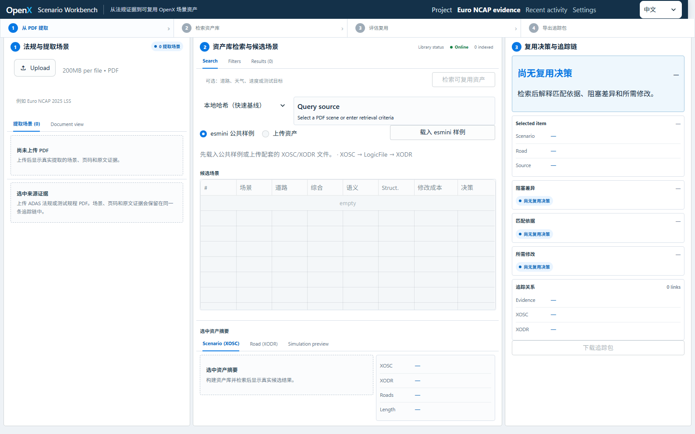

# OpenX Scenario Workbench

[](https://github.com/FFangx/openx-scenario-workbench/actions/workflows/ci.yml)
[](LICENSE)

English | [中文](README.zh-CN.md)

Turn an ADAS requirement into a traceable OpenX reuse decision. OpenX Scenario Workbench extracts numbered scene sections from **PDF**, builds paired **OpenSCENARIO (`.xosc`) + OpenDRIVE (`.xodr`)** assets from files or ScenarioManager-compatible `.sim` archives, and ranks candidates using text, scenario structure, and road fit.

**Try it:** start the app, choose **English** in the top-right corner, and click **Load public demo**. The pinned esmini cut-in example needs no API key, model download, or local input files.



## Design


The two input paths meet only through stable representations: a PDF-derived `ScenePackage` and a paired OpenX asset catalog. Vector recall finds candidates; explicit scenario and road constraints rerank them; source evidence and parsed candidate facts ground the final reuse decision. The parser, retrieval core, and decision logic remain independent of Streamlit.

[Architecture](docs/ARCHITECTURE.md) · [Roadmap](DEVELOPMENT_PLAN.md) · [Third-party notices](THIRD_PARTY_NOTICES.md)

## What it does

- Extracts scenario entities, selected action types, actor assignments, trigger types, and raw position attributes.
- Extracts and classifies text-based PDF scenes using the migrated ScenarioManager V2 / scene-first v6 path, preserving chapter/page evidence and review issues. Configure a model in Settings first.
- Publishes confirmed PDF scene revisions into a shared requirement library; simulation assets have optional model classification with rule/model/final audit history.
- Provides model URL/key settings, model discovery, manual model IDs and a selected-model JSON test.
- Converts each PDF scene package into explicit scenario-family, participant, relative-position, action, trigger, road, and parameter constraints.
- Summarizes road IDs and counts of lane elements, junctions, signals, and static objects.
- Preserves total road length, lane-type counts, and OpenDRIVE geometry types, and projects lane/road/world positions through the reference line for relative-position matching.
- Pairs each `.xosc` with its referenced `.xodr` to build an OpenX asset catalog.
- Imports ScenarioManager-compatible `.sim` ZIP archives, converts their embedded OpenSCENARIO JSON to the same parser input, and pairs cases with contained or separately uploaded `.xodr` roads.
- Uses a lightweight offline encoder or optional BGE embeddings for candidate recall, then ranks candidates by blocking differences and estimated change cost.
- Builds participant interaction signatures from type, ego-relative bearing, facing direction, and actor-owned actions.
- Reports grounded reuse differences such as a mismatched scenario family or participant interaction, or a missing relation, action, trigger, or road feature.
- Checks road-filename references, missing scenario entities, and missing road elements.
- Presents the complete evidence-to-decision path in one responsive three-column workbench: PDF evidence, asset retrieval, and reuse trace.
- Exports a structured decision trace through the web UI; the inspection and search CLIs expose the same parser and retrieval core.
- Loads a fixed revision of an upstream esmini example for a repeatable demo.
- Stores immutable asset versions in a machine-local global library, keeps named projects and multiple PDFs, and exports version-pinned JSON and HTML decisions.
- Accepts a portable `.zip` containing XOSC, XODR, catalogs, models, and textures in their original relative layout.
- Runs real esmini frames inside the page on Windows when the user starts a preview and supplies a working local esmini installation.
- Offers on-demand evidence-linked explanations from the selected PDF text and versioned OpenX facts when a model key is configured.

The app does not perform full ASAM schema/conformance validation. PDF OCR and table reconstruction, parameter expressions, external-catalog parsing, XOSC trigger thresholds, and event hierarchy are not yet fully supported. The UI never fabricates media: PDF thumbnails come from the uploaded document and preview images come from esmini. Model explanations cite supplied evidence but require human review for factual accuracy. See [local assets and preview](docs/LOCAL_ASSETS_AND_PREVIEW.md) and [architecture and current limits](docs/ARCHITECTURE.md).

See [PDF migration and model setup](docs/PDF_MIGRATION.md) for scope, storage and validation.

## Quick start

Requires **Python 3.10 or newer**. Commands below are run from the repository root.

```bash
git clone https://github.com/FFangx/openx-scenario-workbench.git
cd openx-scenario-workbench
python -m venv .venv
```

Activate the environment:

```powershell
# Windows PowerShell
.\.venv\Scripts\Activate.ps1
```

```bash
# macOS / Linux
source .venv/bin/activate
```

Install and start:

```bash
python -m pip install ".[dev]"
python -m streamlit run src/openx_workbench/app.py
```

Open the local URL printed by Streamlit. **Public demo** downloads two files from GitHub; **Upload assets** accepts `.sim`, `.xosc`, `.xodr`, and portable `.zip` dependency packages. A `.sim` case is admitted only when its referenced road is available inside the archive or among the supplemental uploads; missing road references are reported instead of silently creating incomplete assets.

### CLI and offline sample

The small fixtures are authored for parser tests, not for simulator execution. They also provide an offline inspection example:

```bash
openx-inspect tests/fixtures/minimal.xosc tests/fixtures/minimal.xodr
```

The output has three top-level keys:

```json
{
  "scenario": {
    "name": "Minimal cut-in",
    "road_file": "minimal.xodr",
    "entities": [
      {"name": "Ego", "kind": "vehicle", "category": "car"},
      {"name": "Target", "kind": "vehicle", "category": "car"}
    ]
  },
  "road": {"road_ids": ["1"], "lane_count": 3},
  "warnings": []
}
```

This excerpt omits other parsed fields. Standard output contains JSON only; human-readable warnings go to standard error. A valid inspection exits with 0, including inspections with warnings. Invalid input exits with 2.

### Download the real public example

```bash
python scripts/fetch_esmini_demo.py
openx-inspect examples/esmini/cut-in.xosc examples/esmini/e6mini.xodr
```

The pinned example currently yields **2 entities, 6 actions, 5 trigger conditions, and 1 road**. These are extraction counts, not simulated behavior measurements. Downloads are stored under ignored `examples/esmini/`, alongside the upstream license.

### Build and search an OpenX asset library

Place related `.xosc` and `.xodr` files under one directory. Each scenario is paired with the OpenDRIVE basename referenced by its `LogicFile`:

```bash
openx-search examples/esmini "cut-in SpeedAction relative distance"
```

The middle workbench column exposes the same flow and reports vector, scenario-structure, and road-fit evidence. Upload an ADAS PDF in the left column, select an extracted scene section, and its text, structured constraints, and source evidence become the retrieval query. The right column explains the reuse level, blocking differences, required edits, and traceability links.

For semantic retrieval and a reusable on-disk index:

```bash
python -m pip install ".[semantic]"
openx-search examples/esmini "target vehicle cuts in" --encoder bge --index .openx/index.json
```

The BGE model is downloaded by SentenceTransformers on first use. The index records the encoder and ordered asset IDs, so it cannot silently be reused with a different model or catalog.

## Development

After changing Python source files, reinstall with `python -m pip install ".[dev]"`. An editable install (`-e`) is also available, but normal installation avoids editable-path encoding issues on Windows installations with non-ASCII checkout paths.

```bash
python -m pytest -q
```

CI tests on Windows and Linux with Python 3.10 and 3.12 and builds the distribution. Automated tests use local fixtures and mocked downloads; the live public demo is checked separately.

## License and examples

Code and authored test fixtures are licensed under [MIT](LICENSE). The optional esmini example is fetched from a pinned upstream revision and is not committed to this repository. See [third-party notices](THIRD_PARTY_NOTICES.md) for its source and license.
# Windows desktop launcher

See [desktop launcher setup](docs/DESKTOP_LAUNCHER.md) for the OpenX start/stop
shortcuts and tray controls. Daily use requires no terminal.
