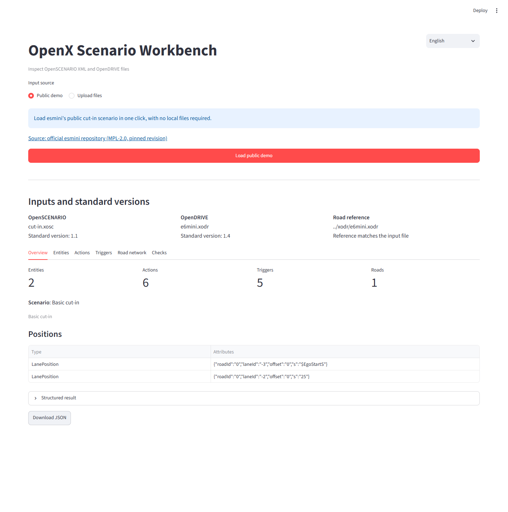

# OpenX Scenario Workbench

[](https://github.com/FFangx/openx-scenario-workbench/actions/workflows/ci.yml)
[](LICENSE)

English | [中文](README.zh-CN.md)

Turn an ADAS requirement into a traceable OpenX reuse decision. OpenX Scenario Workbench extracts numbered scene sections from **PDF**, builds paired **OpenSCENARIO (`.xosc`) + OpenDRIVE (`.xodr`)** assets, and ranks candidates using text, scenario structure, and road fit.

**Try it:** start the app, choose **English** in the top-right corner, and click **Load public demo**. The pinned esmini cut-in example needs no API key, model download, or local input files.



## Design


The two input paths meet only through stable representations: a PDF-derived `ScenePackage` and a paired OpenX asset catalog. Vector recall finds candidates; explicit scenario and road constraints rerank them; source evidence and parsed candidate facts ground the final reuse decision. The parser, retrieval core, and decision logic remain independent of Streamlit.

[Architecture](docs/ARCHITECTURE.md) · [Roadmap](DEVELOPMENT_PLAN.md) · [Third-party notices](THIRD_PARTY_NOTICES.md)

## What it does

- Extracts scenario entities, selected action types, actor assignments, trigger types, and raw position attributes.
- Extracts candidate scene sections from text-based PDFs while retaining filename, section, page range, and source text.
- Converts each PDF scene package into explicit entity, action, trigger, road, and parameter constraints.
- Summarizes road IDs and counts of lane elements, junctions, signals, and static objects.
- Preserves total road length, lane-type counts, and OpenDRIVE geometry types.
- Pairs each `.xosc` with its referenced `.xodr` to build an OpenX asset catalog.
- Retrieves assets with either a lightweight offline encoder or optional BGE embeddings, plus scenario-structure and road-fit reranking.
- Reports grounded reuse differences such as a missing participant, action, trigger, or road feature.
- Checks road-filename references, missing scenario entities, and missing road elements.
- Shows the result in six views: Overview, Entities, Actions, Triggers, Road network, and Checks.
- Exports the same structured JSON through the web UI and CLI.
- Loads a fixed revision of an upstream esmini example for a repeatable demo.

The current MVP foundation does not run a simulation or perform full ASAM schema/conformance validation. PDF OCR and table reconstruction, parameter expressions, external catalogs, trigger thresholds in XOSC, and event hierarchy are not yet fully supported. See [architecture and current limits](docs/ARCHITECTURE.md).

## Quick start

Requires **Python 3.10 or newer**. Commands below are run from the repository root.

```bash
git clone https://github.com/FFangx/openx-scenario-workbench.git
cd openx-scenario-workbench
python -m venv .venv
```

Activate the environment:

```powershell
# Windows PowerShell
.\.venv\Scripts\Activate.ps1
```

```bash
# macOS / Linux
source .venv/bin/activate
```

Install and start:

```bash
python -m pip install ".[dev]"
python -m streamlit run src/openx_workbench/app.py
```

Open the local URL printed by Streamlit. **Public demo** downloads two files from GitHub; **Upload files** works with your own local pair.

### CLI and offline sample

The small fixtures are authored for parser tests, not for simulator execution. They also provide an offline inspection example:

```bash
openx-inspect tests/fixtures/minimal.xosc tests/fixtures/minimal.xodr
```

The output has three top-level keys:

```json
{
  "scenario": {
    "name": "Minimal cut-in",
    "road_file": "minimal.xodr",
    "entities": [
      {"name": "Ego", "kind": "vehicle", "category": "car"},
      {"name": "Target", "kind": "vehicle", "category": "car"}
    ]
  },
  "road": {"road_ids": ["1"], "lane_count": 3},
  "warnings": []
}
```

This excerpt omits other parsed fields. Standard output contains JSON only; human-readable warnings go to standard error. A valid inspection exits with 0, including inspections with warnings. Invalid input exits with 2.

### Download the real public example

```bash
python scripts/fetch_esmini_demo.py
openx-inspect examples/esmini/cut-in.xosc examples/esmini/e6mini.xodr
```

The pinned example currently yields **2 entities, 6 actions, 5 trigger conditions, and 1 road**. These are extraction counts, not simulated behavior measurements. Downloads are stored under ignored `examples/esmini/`, alongside the upstream license.

### Build and search an OpenX asset library

Place related `.xosc` and `.xodr` files under one directory. Each scenario is paired with the OpenDRIVE basename referenced by its `LogicFile`:

```bash
openx-search examples/esmini "cut-in SpeedAction relative distance"
```

The web UI exposes the same flow under **Asset retrieval** and reports the vector, scenario-structure, and road-fit scores separately. An optional ADAS PDF can be uploaded there; select an extracted scene section to use its text, structured constraints, and source evidence as the retrieval query.

For semantic retrieval and a reusable on-disk index:

```bash
python -m pip install ".[semantic]"
openx-search examples/esmini "target vehicle cuts in" --encoder bge --index .openx/index.json
```

The BGE model is downloaded by SentenceTransformers on first use. The index records the encoder and ordered asset IDs, so it cannot silently be reused with a different model or catalog.

## Development

After changing Python source files, reinstall with `python -m pip install ".[dev]"`. An editable install (`-e`) is also available, but normal installation avoids editable-path encoding issues on Windows installations with non-ASCII checkout paths.

```bash
python -m pytest -q
```

CI tests on Windows and Linux with Python 3.10 and 3.12 and builds the distribution. Automated tests use local fixtures and mocked downloads; the live public demo is checked separately.

## License and examples

Code and authored test fixtures are licensed under [MIT](LICENSE). The optional esmini example is fetched from a pinned upstream revision and is not committed to this repository. The screenshot above shows an inspection of that example. See [third-party notices](THIRD_PARTY_NOTICES.md) for its source and license.
