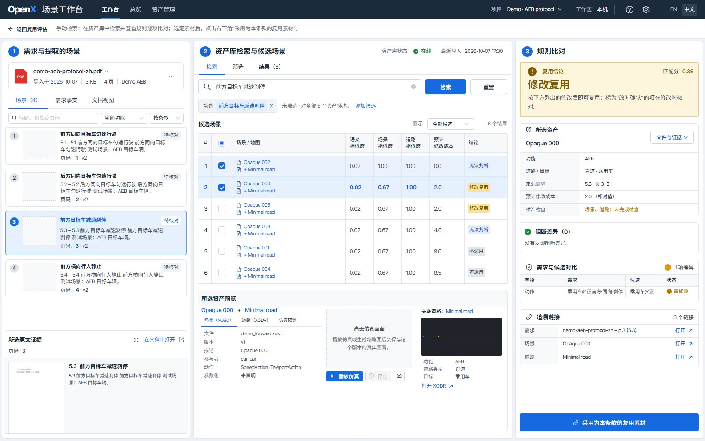
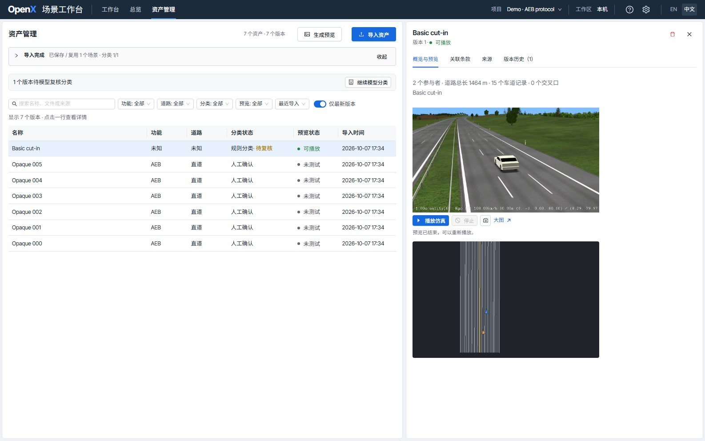
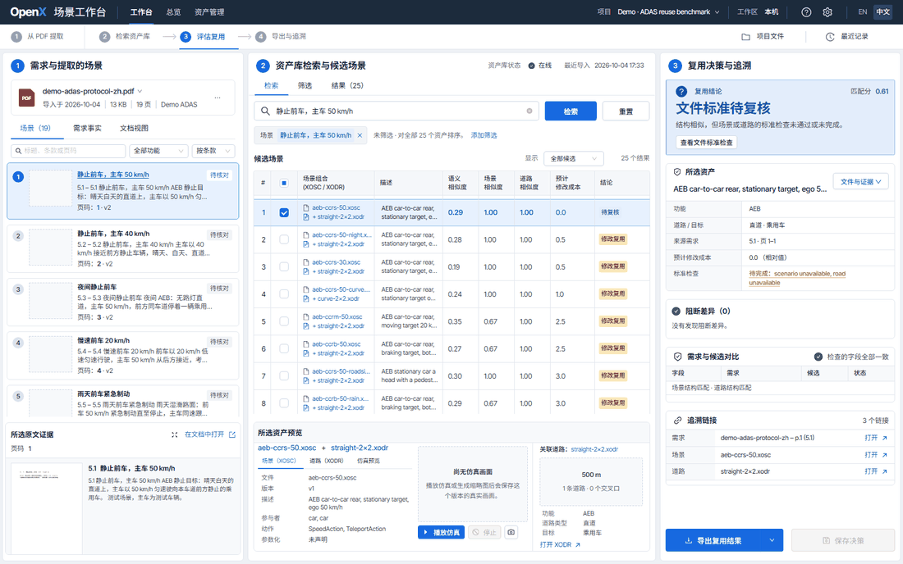

# OpenX 场景工作台

[English](README.md) | 中文

**Windows 桌面入口**：配置[桌面启动器](docs/DESKTOP_LAUNCHER.md)后，双击桌面 `OpenX` 即可启动服务并打开网页；双击 `OpenX - Stop` 或使用托盘菜单即可关闭服务和预览进程。

将智驾/辅助驾驶要求转成可追溯的 OpenX 复用判断。本工具从 **PDF** 提取带页码和章节证据的场景包，从独立文件或 ScenarioManager 兼容的 `.sim` 归档构建 **OpenSCENARIO（`.xosc`）+ OpenDRIVE（`.xodr`）** 组合资产，并结合文本、场景结构和道路适配度排序。对规程 PDF 的每个条款，由已配置的语言模型推荐可复用的素材（直接复用、修改复用、不适用、无法判断），经人工确认形成复用结论。

**快速体验**：启动工作台（见[安装与启动](#安装与启动)）后进入**资产管理 → 导入资产 → 公开 esmini 示例**，即可导入并检查固定版本的 esmini cut-in 场景，无需 API Key、模型下载或自备文件。想不准备任何文件就走完整流程，安装后运行 `openx-demo`：它会在自行编写的 26 个资产、38 条已复核需求上打开工作台（见[演示工作区](#演示工作区)）。语言切换位于右上角；语义检索和仿真预览的依赖见下文。



*`openx-demo` 上的条款复用评估：左侧每个条款一行，模型推荐的首选复用素材、3 次评估是否一致，前三行已人工确认（绿色对勾）；右侧是所选条款的原文证据、首选素材的 esmini 画面与道路俯视图，以及每个候选的判断和理由。演示中的建议为预先录制的真实模型结果；模型按界面语言写理由。*



*导入 esmini 公开 cut-in 示例（MPL-2.0）并播放一次后的资产管理页；画面由 esmini 渲染，不是示意图。*

## 使用流程

| 页面或操作 | 用法 |
| --- | --- |
| **工作台** | 打开后先看到起始页：输入场景描述检索、导入 PDF，或继续处理项目里已有的 PDF（点 Logo 可回到起始页）。导入前在项目菜单中新建项目、在**设置**中配置模型；项目就是本机的一个文件夹（默认在“文档\OpenX 项目”），导入的 PDF 和导出的评估表都存在里面，可从项目菜单打开、改名或删除。打开 PDF 即为它的**条款复用评估**：每个条款一行，显示首选复用素材；右侧是条款原文、素材的仿真画面和道路俯视图，以及全部候选和模型理由。可同时查看多份 PDF。 |
| **生成复用建议** | 已配置的模型用最深的思考等级对每个条款独立评估 3 次，按直接复用、修改复用、不适用、无法判断四档给出建议和修改内容；3 次推荐相同标“一致 3/3”，不同标“不一致”。 |
| **确认复用结论** | 先一键采纳全部一致的“直接复用”建议，再逐条复核其余条款；不同意时可改档位、改素材或改修改内容。人工确认的结论带绿色对勾，各项目共用，并固定所采用的素材版本；素材出新版本或条款事实被修改时标“待重新确认”。 |
| **手动检索** | 在条款上自行检索资产库：规则排序、需求事实和规则逐项比对；点**采用为本条款的复用素材**即存为该条款的结论。 |
| **导出复用评估表** | 当前所看 PDF 的一张表，可导出 CSV（可用 Excel 打开）或网页。 |
| **自由文本检索** | 在起始页输入场景描述（或在手动检索中关闭“场景”标签）。相似资产以卡片形式显示在独立的结果页，点开可看详情。文本检索不作复用结论。 |
| **播放仿真** | 在条款详情、候选预览或资产详情中使用**播放仿真**、**停止**、**生成缩略图**。自动查找已安装的 Windows esmini；特殊位置在**设置 → 本机服务**中选择。 |
| **总览** | 按 PDF 显示条款复用覆盖（可复用、不适用、待确认、待重新确认）、未被任何条款采用的素材，以及资产库的几个数字。 |
| **资产管理** | 导入 `.sim`、配对的 `.xosc` / `.xodr` 或依赖 `.zip`；选中版本查看预览、关联条款、来源（含分类和文件标准检查）和版本历史。 |

资产版本和复用结论在项目间共享；PDF 原文和场景修订属于当前项目。

## 评测

自行编写的[复用评测集](examples/reuse-benchmark/)包含 26 个资产和 38 条中英文需求，逐条标注了期望候选和期望复用等级，用来衡量检索和复用判断；消融实验说明排序中真正起作用的是哪一部分：

| 排序方式 | R@1（描述性名称） | R@1（无意义名称） | 首位候选被误当作可直接复用 |
|---|---:|---:|---:|
| 名称相似度（BGE-M3） | 57.1% | 25.7% | 38 条中 22–33 条 |
| 结构摘要相似度（哈希） | 94.3% | 94.3% | 38 条中 13 条 |
| 工作台：结构规则优先，相似度排序同档候选 | 100% | 100% | 38 条中 0 条 |

基于结构事实的相似度能找到大部分正确资产，却判断不了最相似的资产是否还需要修改；结构判断没有给出任何错误的“直接复用”。标注遵循文档中的复用规则，需求以已复核的结构输入，因此这里检验的是一致性，不包括 PDF 提取，也不代表工程判断本身。方法、完整结果和局限见[评测说明](docs/EVALUATION.md)，用 `openx-ablation` 复现。

## 当前能力

- 提取参与者、部分动作类型、动作所属参与者、触发条件类型和原始位置属性。
- 使用迁移后的 ScenarioManager V2 / scene-first 路径（提示词 v10：先找场景，再逐个读结构并附原文依据；模型支持图片时连同场景示意图一起读）识别、分类并提取文字或扫描 PDF 场景，保留表格单元格、章节、页码、原文和复核提示；扫描页需安装本机 OCR，提取前需配置语言模型。
- 用已配置的语言模型为每个条款推荐复用素材：从规则排序、素材名、结构摘要和条款标题汇集约 20 个候选；用最深的思考等级独立评估 3 次，取推荐最多的素材并标出不一致；四档结论由人确认或修改。
- 仿真资产按规则从文件读出功能、道路和目标标签，支持人工修正和分类审计历史。
- 设置中支持服务地址、API Key、获取模型清单、选择或手动输入模型名，以及所选模型的 JSON 可用性测试。
- 将 PDF 场景包转换为参与者、动作、触发器、道路和参数约束。
- 汇总道路 ID、车道元素、路口、信号和静态对象数量。
- 保留道路总长、车道类型数量和 OpenDRIVE 几何类型。
- 按 `LogicFile` 引用将 `.xosc` 与 `.xodr` 配对，构建 OpenX 组合资产。
- 导入 ScenarioManager 兼容的 `.sim` ZIP，将其中的 OpenSCENARIO JSON 转成统一解析输入，并用归档内或额外上传的 `.xodr` 完成道路配对。
- 对已复核的需求，全库资产逐一做结构比较，按阻断差异数、再按修改成本排序；BGE-M3（或显式选择的离线哈希基线）只在修改量相同的候选之间排序，并用于自由文本检索。
- 参与者按阻断差异最少的方式一一配对；需求写明某个参与者的初始速度时，按参与者逐个比较速度。
- 手动检索中的规则结论与评估表用同一套四档：直接复用、修改复用、不适用、无法判断；结论下方一句话说明原因，如修改量接近新建、文件标准检查未完成。
- 输出缺少参与者、动作、触发器或道路特征等有依据的复用差异。
- 检查道路文件名引用是否一致、场景是否缺少参与者、道路文件是否缺少 road 元素。
- 提供中英双语的工作台、总览和资产管理；工作台并排显示所选需求的证据、候选和复用判断，耗时的导入以后台任务运行并显示进度。
- 网页可导出结构化决策追踪；检查与检索 CLI 复用同一套解析和检索核心。
- 一键加载固定上游版本的 esmini 示例，便于复现。
- 全局本机资产库保存不可变版本；命名项目可保存多份 PDF，并导出绑定资产版本的 JSON 与 HTML 决策。
- 可上传保留原始相对目录结构的 `.zip` 包，将 XOSC、XODR、Catalog、模型及纹理一起用于预览。
- 在 Windows 上自动查找本机 esmini；点击“播放仿真”后在网页内显示真实画面，支持停止、重播并保留失败详情。
- 配置模型密钥后，可按需用所选 PDF 原文和已解析的 OpenX 事实生成带证据编号的解释。
- 直接复用确认要求场景与道路均通过 XSD 检查；保存单场景或批量决策时重新核对实际资产文件。
- 在**资产管理 → 来源**中生成有转换与校验记录的 SIM 标准副本；未通过检查时只提供诊断包，保留原文件和不支持的扩展内容。

安装本机 Schema 库后，可离线按文件声明的版本检查 XSD，并显示具体诊断；这不代表完整 ASAM 语义认证或仿真通过。原生表格与可选 PP-StructureV3 OCR 接入同一场景流程；跨页、合并单元格表格、图示、不支持的参数表达式、未解析的外部 Catalog 和事件层级仍需复核。界面不会伪造媒体：PDF 缩略图来自上传文档，预览画面来自 esmini。模型解释虽附证据编号，事实准确性仍需人工核对。详见[本机资产与预览](docs/LOCAL_ASSETS_AND_PREVIEW.md)和[架构与当前限制](docs/ARCHITECTURE.md)。

模型配置与完整流程见 [PDF 迁移说明](docs/PDF_MIGRATION.md)。

## 安装与启动

需要 **Python 3.10 或更新版本**，以及用于构建界面的 **Node.js 20 或更新版本**。以下命令在仓库根目录运行。

```bash
git clone https://github.com/FFangx/openx-scenario-workbench.git
cd openx-scenario-workbench
python -m venv .venv
```

激活环境：

```powershell
# Windows PowerShell
.\.venv\Scripts\Activate.ps1
```

```bash
# macOS / Linux
source .venv/bin/activate
```

安装、构建界面并启动：

```bash
python -m pip install ".[dev]"
cd web && npm ci && npm run build && cd ..
openx-web
```

打开 <http://127.0.0.1:8765>，服务只在本机监听。在**资产管理 → 导入资产**选择公开示例或上传文件。公开示例从 GitHub 下载场景和道路；上传支持 `.sim`、`.xosc`、`.xodr` 和包含依赖的 `.zip`。只有在 `.sim` 内或额外上传文件中能找到所引用的道路时，该 case 才进入资产库；任务详情列出缺失道路文件名，补充后重新导入即可。

### 按需启用

- **BGE-M3 检索**：执行 `python -m pip install ".[semantic]"`。界面默认 BGE-M3，未缓存时首次使用下载权重，仓库不自带模型；无权重的离线检查需显式选择哈希基线。
- **PDF 提取**：在**设置**中配置服务地址、密钥和模型。导入会将文档文字发送给该服务；扫描 PDF 还需按 [PDF 迁移说明](docs/PDF_MIGRATION.md)安装并配置本机 OCR。
- **标准检查**：先执行 `openx-validate --install-schemas` 下载固定版本的 Schema 库，之后可本机检查。手动检索里，场景和道路都通过检查，规则才会判为“直接复用”。条款的复用结论由人确定，不受检查结果限制，检查结果仅供参考：从仿真软件导出的素材常常通不过。
- **仿真预览**：在 Windows 上单独安装 esmini。自动检测支持 `OPENX_ESMINI_PATH`、PATH、`%LOCALAPPDATA%/OpenXScenarioWorkbench/tools/esmini`，以及下载、桌面、文档和 Program Files 中的 esmini 文件夹；也可在**设置 → 本机服务**中用**浏览安装文件夹**选择安装目录或 `bin` 目录，**自动查找**恢复自动检测。仓库不自带 esmini，部分扩展或缺少依赖会导致无法播放。
- **Windows 桌面入口**：按[桌面启动器说明](docs/DESKTOP_LAUNCHER.md)配置快捷方式和托盘，日常使用无需终端。

### 演示工作区

按上文安装后，一条命令即可在自行编写的演示数据上启动工作台并打开浏览器：

```bash
openx-demo
```

它会在临时文件夹中生成[复用评测集](examples/reuse-benchmark/)：26 个资产，以及一个包含中英两份规程 PDF 的项目，其中 38 条需求均已复核；另附一次真实模型运行录制下来的复用建议（界面标明为录制结果，重新生成需要配置模型）。`openx-demo --language en` 以英文界面打开，回放模型用英文写的建议。打开 PDF 即可看到每个条款建议的复用素材；在条款上点**手动检索**可看到候选排序和规则结论：



不下载任何内容，也不调用模型；检索使用哈希基线（已安装 BGE-M3 时可在**设置**中切换）；按 Ctrl+C 停止后临时文件夹会被删除。请在仓库根目录运行；服务地址为 <http://127.0.0.1:8770>，可与平常的工作台同时运行。

`openx-demo --data-dir demo-data` 会保留工作区供下次使用；`--dataset fixtures` 加载浏览器检查用的 6 个解析测试资产。只生成数据不启动服务时，运行 `python scripts/seed_demo_workspace.py demo-data --dataset benchmark`，再以 `OPENX_DATA_DIR=demo-data` 启动 `openx-web`（PowerShell：`$env:OPENX_DATA_DIR = "demo-data"`）。演示数据不会影响你平常的数据目录。

## CLI 与离线示例

以下最小文件由本项目编写，供解析测试和离线检查使用，并非可直接运行的仿真场景：

```bash
openx-inspect tests/fixtures/minimal.xosc tests/fixtures/minimal.xodr
```

输出顶层字段为 `scenario`、`road`、`warnings`、`validation`，可在[英文首页](README.md#cli-and-offline-sample)查看节选；`validation` 保存按版本检查的 XSD 结果。标准输出只含 JSON，文字警告输出到标准错误流。解析成功时退出码为 0，包括带警告或 XSD 无效、不可用的结果；输入无效或解析失败时退出码为 2。需要退出码反映 XSD 有效性时，使用 `openx-validate`。

下载真实公开示例：

```bash
python scripts/fetch_esmini_demo.py
openx-inspect examples/esmini/cut-in.xosc examples/esmini/e6mini.xodr
```

固定示例当前可提取 **2 个参与者、6 个动作、5 个触发条件和 1 条道路**。这些是结构提取数量，不是仿真行为测量。文件下载到 Git 忽略的 `examples/esmini/`，并保留上游许可证。

构建并检索一个目录中的 OpenX 资产：

```bash
openx-search examples/esmini "目标车切入 SpeedAction 相对距离"
```

工作台的自由文本检索使用同一检索核心。对一个条款，其原文、结构化约束和来源证据形成检索查询：模型建议判断排在前面的候选，手动检索展示匹配依据、阻塞差异、所需修改和追溯关系。

启用语义检索并保存可复用索引：

```bash
python -m pip install ".[semantic]"
openx-search examples/esmini "目标车辆切入" --encoder bge --index .openx/index.json
```

工作台默认使用 BGE-M3；可在**设置 → 高级**中改用本地哈希基线，设置会保留。
模型为每个条款判断的候选也由同一检索召回。

语义模型固定为 BAAI/bge-m3，不会自动换成小模型。首次使用时由 SentenceTransformers 下载。索引记录编码器、资产内容和已确认分类的指纹；模型、分类或资产库变化时不会静默复用旧向量。工作台按资产文本本身保存每条向量，资产库变化时只编码新增或改动的文本。

## 设计与开发

修改 Python 源码后，用 `python -m pip install ".[dev]"` 重新安装。也可使用 `-e` 可编辑安装，但普通安装可避免部分 Windows 环境下含中文目录的可编辑路径编码问题。

React 界面通过本机 FastAPI 服务工作；解析器、检索核心和判断逻辑是普通 Python 模块，与命令行工具共用，后续检索或比较工具可直接消费结构化结果。


[架构说明](docs/ARCHITECTURE.md) · [开发路线](DEVELOPMENT_PLAN.md) · [第三方说明](THIRD_PARTY_NOTICES.md)

运行测试：

```bash
python -m pytest -q
```

开发界面时运行 `openx-web`，并在 `web/` 中运行 `npm run dev`：Vite 在 5173 端口提供界面，并把 `/api` 转发给服务。`npm run build` 会做类型检查并构建；之后 `npm run verify:ui` 在临时演示工作区上运行浏览器检查（它自己启动服务，不会使用你的数据目录）。前端的接口类型由服务的 OpenAPI 文档生成：修改 `src/openx_workbench/api_schemas.py` 后运行 `npm run gen:api`。

CI 在 Windows / Linux、Python 3.10 / 3.12 上测试并构建分发包，并构建和检查网页界面。自动测试使用本地文件与模拟下载；真实公开示例单独验证。

## 许可证

代码与自行编写的测试文件采用 [MIT](LICENSE)。esmini 示例从固定上游版本按需下载，不纳入仓库。来源和许可见[第三方说明](THIRD_PARTY_NOTICES.md)。
